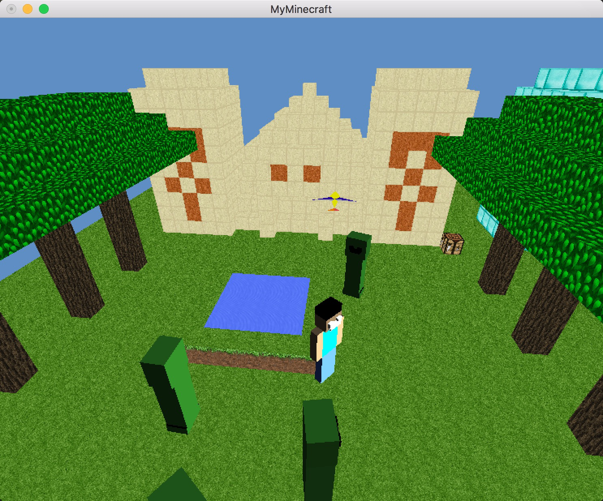
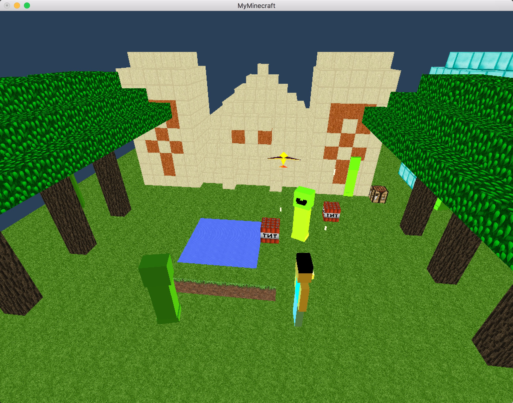

# OpenGL-For-MineCraft

## Overview
本学期上了一门计算机与图形学课，决定趁势研究一下minecraft怎么做出来的。

## Installation

### Mac OS
1. 使用CMake编译CMakeLists来编译
2. 运行程序

## Usage

### 模式切换
* H - 模式切换
* 0 - 上帝模式
* 1 - 第一人称视角模式
* 2 - 第三人称视角模式
* 3 - 虚拟球模式

### 按键操作
* W - 人物前进
* A - 人物左移
* S - 人物后退
* D - 人物右移
* Space - 跳跃
* R - 虚拟球模式  
* Z - 飞机起飞/复位

### 鼠标操作
* 上帝模式下
  * 点击左键 - 放大视角
  * 点击右键 - 缩小视角  
* 第一人称视角模式下
  * 点击左键 - 放置TNT
  * 点击右键 - 放置火炬

## Demo

